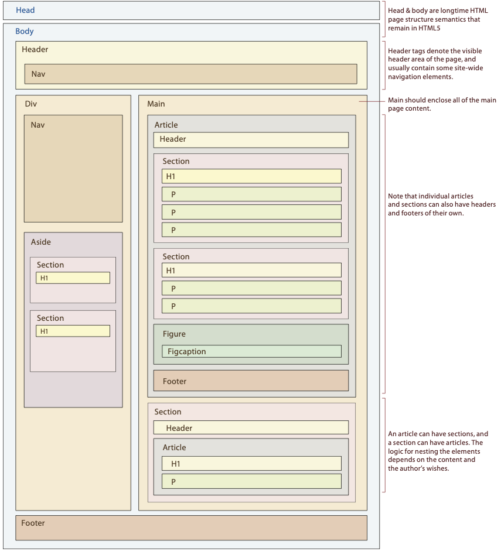

# Proyecto 2

El objetivo de este proyecto es diseñar una serie de pantallas internas del sitio web que fue analizado en el primer proyecto. Para ello se deben elaborar bosquejos de pantalla aplicando los principios de diseño estudiados a través del curso, y luego crear las páginas html asociadas.

## Funcionalidades generales

Todas las aplicaciones, independiente de su tipo, deben contar con las siguientes funcionalidades generales.

### Múltiples usuarios

Cada aplicación debe contar con la capacidad para iniciar la sesión de un usuario y mostrar el contenido de ese usuario particular. Para ello la aplicación debe contar con la opción para crear un nuevo usuario y brindar sus datos (username, password). Utilice sesiones para mantener la seguridad del trabajo de los usuarios.

### Sistema de ayuda

Se debe incluir una opción en donde se presente información de ayuda al usuario. Esta opción podrá incluir una o varias pantallas que describan las diferentes funcionalidades de la aplicación.

### Búsqueda sobre contenido

Se debe habilitar campos de búsqueda en donde el usuario puede ingresar palabras clave que serán utilizadas para realizar la búsqueda sobre el diferente contenido que administra la aplicación. De igual forma, se deberá mostrar la lista de aquellos elementos que cumplen con esa condición de búsqueda.

### Compartir contenido entre usuarios

Deben existir las operaciones para compartir algún contenido específico con otros usuarios. De esta forma otros usuarios podrán encontrar elementos de contenido que ellos no crearon pero otros usuarios comparten con ellos.

## Elaboración de páginas

### Bosquejos de la página

Se deben crear bosquejos que muestre la distribucción de cada una de las secciones que conformarán la página en escritorio (diseño responsivo). Dichos bosquejos se pueden realizar con cualquier software adecuado, pero se recomienda la utilización de [Pencil](https://pencil.evolus.vn/).

En los bosquejos se debe incluir el texto final que se pretende utilizar en las diferentes secciones, así como las imágenes reales que se incorporarán. 

Adicionalmente, a los bosquejos de página, se debe crear un diagrama de bloques (similar al que se muestra más abajo) en donde se especifique el tipo de elemento HTML5 que será utilizado para estructurar el código de la página final. Se debe evitar utilizar elementos `div` e incluir las etiquetas adecuada para el tipo de elemento que se pretende estructurar.

### Construcción de la página

A partir de los bosquejos realizados anteriormente se debe elaborar la página web en código HTML y utilizando un framework CSS. Se debe utilizar cualquiera de los frameworks CSS estudiados en el curso, pero no algún otro que no haya sido analizado previamente. Note que dicho framework debe facilitar el uso de capacidades responsivas.

Los elementos HTML utilizados deben coincidir con el diagrama de bloques que se elaboró y deben utilizar la clase (class) adecuada del framework CSS con el fin de estructurar el contenido de la página completa tomando en cuenta las capacidades responsivas del framework.

## Forma de evaluación

Los diferentes requisitos de este proyecto serán evaluados en la siguiente forma:

* Bosquejos de página - 40 %
* Diagrama de bloques - 10 %
* Página web final - 50 %

### Publicación del sitio

Todo el código de la página desarrollada debe ser subido a un repositorio de Classroom. Adicionalmente debe ser publicado en un servidor de hosting (netlify o cualquier otro).
